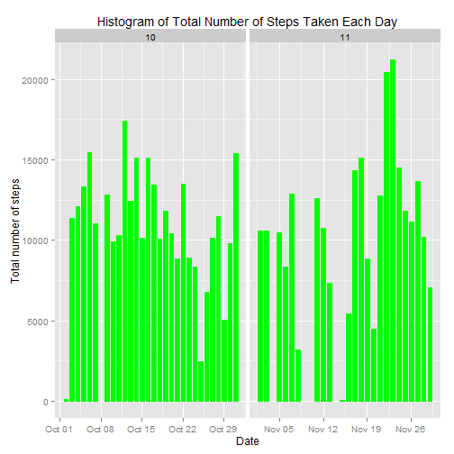
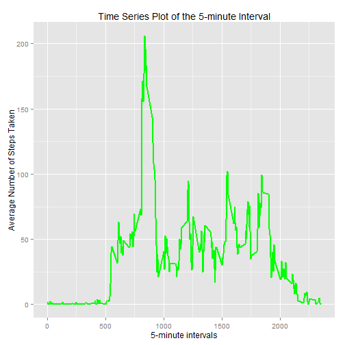
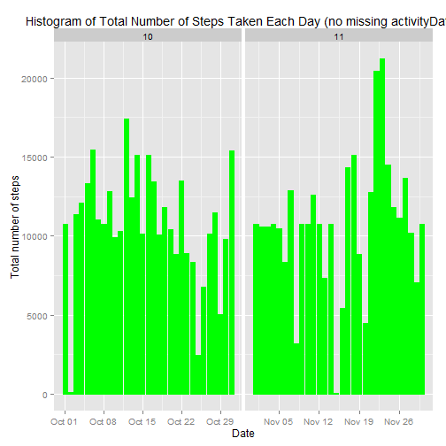

## Global settings

```r
# make R code globally visible
echo = TRUE  
```

## Loading and processing the activityData

```r
unzip("activity.zip")
activityData <- read.csv("activity.csv", colClasses = c("integer", "Date", "factor"))
activityData$month <- as.numeric(format(activityData$date, "%m"))
withoutNA <- na.omit(activityData)
rownames(withoutNA) <- 1:nrow(withoutNA)
head(withoutNA)
```

```
##   steps       date interval month
## 1     0 2012-10-02        0    10
## 2     0 2012-10-02        5    10
## 3     0 2012-10-02       10    10
## 4     0 2012-10-02       15    10
## 5     0 2012-10-02       20    10
## 6     0 2012-10-02       25    10
```

```r
dim(withoutNA)
```

```
## [1] 15264     4
```

```r
library(ggplot2)
```

```
## Warning: package 'ggplot2' was built under R version 3.1.3
```


## What is mean total number of steps taken per day?
For this part of the assignment, you can ignore the missing values in the dataset.

* Histogram of the total number of steps taken each day


```r
ggplot(withoutNA, aes(date, steps)) + geom_bar(stat = "identity", colour = "green", fill = "green", width = 0.7) + facet_grid(. ~ month, scales = "free") + labs(title = "Histogram of Total Number of Steps Taken Each Day", x = "Date", y = "Total number of steps")
```

 

```r
dev.copy(png, file="figure/plot1.png", height=480, width=480)
dev.off()
```

Mean of the total number of steps taken per day:

```r
totalSteps <- aggregate(withoutNA$steps, list(Date = withoutNA$date), FUN = "sum")$x
mean(totalSteps)
```

```
## [1] 10766.19
```
Median of the total number of steps taken per day:

```r
median(totalSteps)
```

```
## [1] 10765
```

## What is the average daily activity pattern?
* Time series plot of type = "l" of the 5-minute interval (x-axis) and the average number of steps taken, averaged across all days (y-axis)


```r
avgSteps <- aggregate(withoutNA$steps, list(interval = as.numeric(as.character(withoutNA$interval))), FUN = "mean")
names(avgSteps)[2] <- "meanOfSteps"

ggplot(avgSteps, aes(interval, meanOfSteps)) + geom_line(color = "green", size = 0.8) + labs(title = "Time Series Plot of the 5-minute Interval", x = "5-minute intervals", y = "Average Number of Steps Taken")
```

 

```r
dev.copy(png, file="figure/plot2.png", height=480, width=480)
dev.off()
```

* 5-minute interval, on average across all the days in the dataset, which contains the maximum number of steps

```r
avgSteps[avgSteps$meanOfSteps == max(avgSteps$meanOfSteps), ]
```

```
##     interval meanOfSteps
## 104      835    206.1698
```

## Imputing missing values
* The total number of rows with NAs:


```r
sum(is.na(activityData))
```

```
## [1] 2304
```

* Strategy for filling in all of the missing values in the dataset.Using the mean of 5-minute interval to fill each NA value in the steps column.

* Here is a new dataset that is equal to the original dataset but with the missing activityData filled in.


```r
newData <- activityData 
for (i in 1:nrow(newData)) {
    if (is.na(newData$steps[i])) {
        newData$steps[i] <- avgSteps[which(newData$interval[i] == avgSteps$interval), ]$meanOfSteps
    }
}

head(newData)
```

```
##       steps       date interval month
## 1 1.7169811 2012-10-01        0    10
## 2 0.3396226 2012-10-01        5    10
## 3 0.1320755 2012-10-01       10    10
## 4 0.1509434 2012-10-01       15    10
## 5 0.0754717 2012-10-01       20    10
## 6 2.0943396 2012-10-01       25    10
```

```r
sum(is.na(newData))
```

```
## [1] 0
```

* Histogram of the total number of steps taken each day and mean and median of the total number of steps taken per day. 


```r
ggplot(newData, aes(date, steps)) + geom_bar(stat = "identity",
                                             colour = "green",
                                             fill = "green",
                                             width = 0.8) + facet_grid(. ~ month, scales = "free") + labs(title = "Histogram of Total Number of Steps Taken Each Day (no missing activityData)", x = "Date", y = "Total number of steps")
```

 

```r
dev.copy(png, file="figure/plot3.png", height=480, width=480)
dev.off()
```

* Do these values differ from the estimates from the first part of the assignment? What is the impact of imputing missing activityData on the estimates of the total daily number of steps?

Mean total number of steps taken per day:

```r
newTotalSteps <- aggregate(newData$steps, 
                           list(Date = newData$date), 
                           FUN = "sum")$x
newMean <- mean(newTotalSteps)
newMean
```

```
## [1] 10766.19
```
Median total number of steps taken per day:

```r
newMedian <- median(newTotalSteps)
newMedian
```

```
## [1] 10766.19
```
Comparing them with the two before imputing missing activityData:

```r
oldMean <- mean(totalSteps)
oldMedian <- median(totalSteps)
newMean - oldMean
```

```
## [1] 0
```

```r
newMedian - oldMedian
```

```
## [1] 1.188679
```
After imputing the missing activityData, the new mean of total steps taken per day is the same as that of the old mean; the new median of total steps taken per day is greater than that of the old median.

## Are there differences in activity patterns between weekdays and weekends?

* New factor variable in the dataset with two levels -- "weekday" and "weekend" indicating whether a given date is a weekday or weekend day.


```r
head(newData)
```

```
##       steps       date interval month
## 1 1.7169811 2012-10-01        0    10
## 2 0.3396226 2012-10-01        5    10
## 3 0.1320755 2012-10-01       10    10
## 4 0.1509434 2012-10-01       15    10
## 5 0.0754717 2012-10-01       20    10
## 6 2.0943396 2012-10-01       25    10
```

```r
newData$weekdays <- factor(format(newData$date, "%A"))
levels(newData$weekdays)
```

```
## [1] "Friday"    "Monday"    "Saturday"  "Sunday"    "Thursday"  "Tuesday"  
## [7] "Wednesday"
```

```r
levels(newData$weekdays) <- list(weekday = c("Monday", "Tuesday",
                                             "Wednesday", 
                                             "Thursday", "Friday"),
                                 weekend = c("Saturday", "Sunday"))
levels(newData$weekdays)
```

```
## [1] "weekday" "weekend"
```

```r
table(newData$weekdays)
```

```
## 
## weekday weekend 
##   12960    4608
```

* Panel plot containing a time series plot of type = "l" of the 5-minute interval (x-axis) and the average number of steps taken, averaged across all weekday days or weekend days (y-axis).


```r
avgSteps <- aggregate(newData$steps, 
                      list(interval = as.numeric(as.character(newData$interval)), 
                           weekdays = newData$weekdays),
                      FUN = "mean")
names(avgSteps)[3] <- "meanOfSteps"
library(lattice)
xyplot(avgSteps$meanOfSteps ~ avgSteps$interval | avgSteps$weekdays, 
       layout = c(1, 2), type = "l",
       xlab = "Interval", ylab = "Number of steps")
```

 

```r
dev.copy(png, file="figure/plot4.png", height=480, width=480)
dev.off()
```
